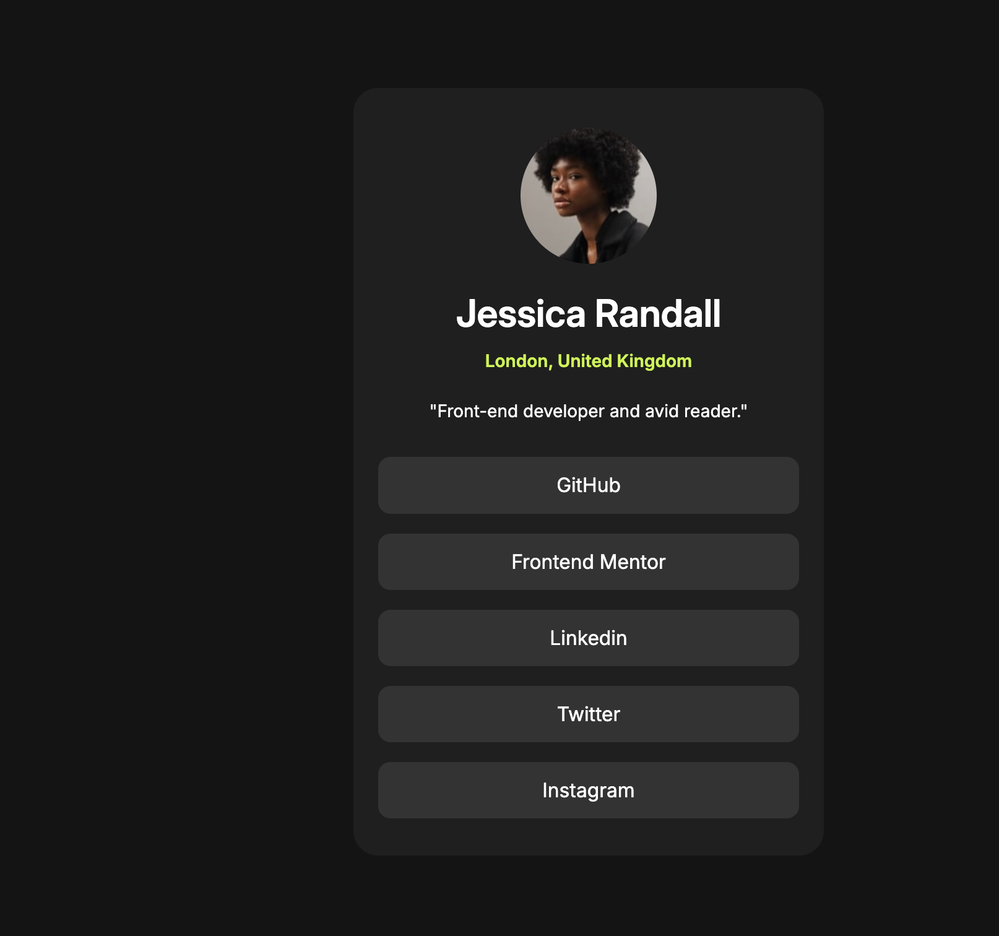

# Frontend Mentor - Blog preview card solution

This is a solution to the [Blog preview card challenge on Frontend Mentor](https://www.frontendmentor.io/challenges/blog-preview-card-ckPaj01IcS). Frontend Mentor challenges help you improve your coding skills by building realistic projects. 

## Table of contents

- [Overview](#overview)
  - [The challenge](#the-challenge)
  - [Screenshot](#screenshot)
  - [Links](#links)
- [My process](#my-process)
  - [Built with](#built-with)
  - [What I learned](#what-i-learned)
  - [Continued development](#continued-development)
  - [Useful resources](#useful-resources)
- [Author](#author)


**Note: Delete this note and update the table of contents based on what sections you keep.**

## Overview

### The challenge

Users should be able to:

- See hover and focus states for all interactive elements on the page

### Screenshot



Add a screenshot of your solution. The easiest way to do this is to use Firefox to view your project, right-click the page and select "Take a Screenshot". You can choose either a full-height screenshot or a cropped one based on how long the page is. If it's very long, it might be best to crop it.

Alternatively, you can use a tool like [FireShot](https://getfireshot.com/) to take the screenshot. FireShot has a free option, so you don't need to purchase it. 

Then crop/optimize/edit your image however you like, add it to your project, and update the file path in the image above.

**Note: Delete this note and the paragraphs above when you add your screenshot. If you prefer not to add a screenshot, feel free to remove this entire section.**

### Links

- Solution URL: (https://cheese-bur.netlify.app)
- Live Site URL: (https://cheese-bur.netlify.app)

## My process

### Built with

- Semantic HTML5 markup
- CSS custom properties
- Flexbox


### What I learned


```html
<h1>Some HTML code I'm proud of</h1>
```
```css
.proud-of-this-css {
  color: papayawhip;
}
```
```js
const proudOfThisFunc = () => {
  console.log('🎉')
}
```


### Continued development

In my journey to becoming a Full-stack developer, I plan to focus on:

JavaScript Frameworks: Dive deeper into frameworks like React, Angular, or Vue.js to enhance my frontend development skills.
Backend Development: Learn server-side technologies such as Node.js, Express, or Django to build robust backend systems.
Databases: Understand both SQL (e.g., PostgreSQL, MySQL) and NoSQL (e.g., MongoDB) databases to manage and store data efficiently.
API Development: Gain experience in building and consuming RESTful and GraphQL APIs to enable seamless frontend-backend communication.
DevOps Practices: Explore tools like Docker, Kubernetes, and CI/CD pipelines to streamline development processes and deployments.
Cloud Services: Familiarize myself with cloud platforms such as AWS, Azure, or Google Cloud for scalable application hosting and services.
Testing: Implement unit, integration, and end-to-end testing to ensure code quality and reliability.
Security: Learn best practices for securing applications at both the frontend and backend levels.


### Useful resources

(https://www.freecodecamp.org) - A comprehensive platform with tutorials and projects to learn web development.
(https://developer.mozilla.org) - An excellent resource for in-depth documentation on web technologies.
(https://www.codecademy.com) - Interactive courses and exercises to practice coding skills.


## Author

Frontend Mentor - (https://www.frontendmentor.io/profile/Rtobdowu-570)
Twitter - (https://x.com/AndrewPete38959)


## SOCIAL-LINK-PROFILE
# Social-link-Profile
